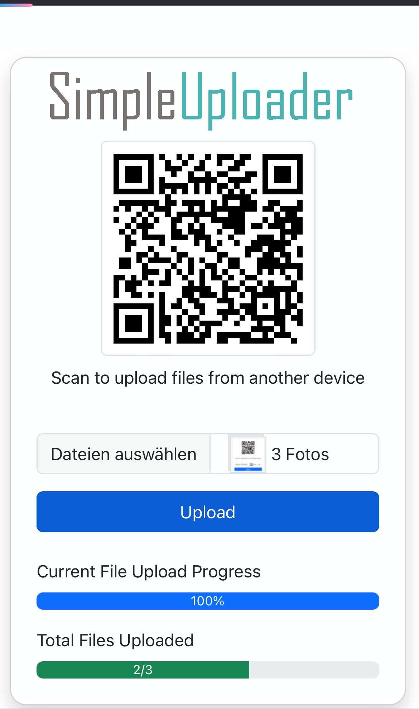
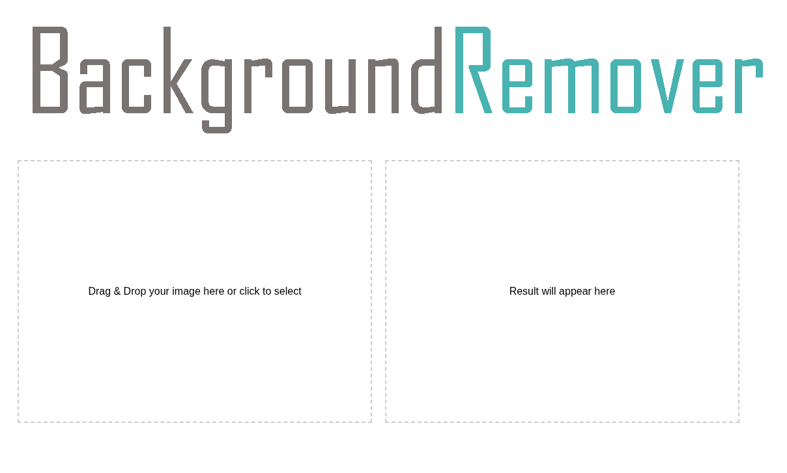

Collection of Python Scripts

<table>
  <tr>
    <td colspan="2">
      
    </td>
  </tr>
  <tr>
    <td colspan="2">
      
This Simple Uploader lets you quickly upload files (e.g. from your phone) to your PC over the local network — no cables, no cloud, just drag and drop.

    </td>
  </tr>
  <tr>
    <td></td>
    <td>
      <h3>Features</h3>
      <ul>
        <li>Upload multiple files at once</li>
        <li>Real-time upload progress</li>
        <li>Automatically shows a QR Code to access the uploader from mobile</li>
        <li>Files are saved directly to your `~/Downloads` folder</li>
      </ul>
      <h3>Installation</h3>
      <ol>
        <li>Clone or download this project.</li>
        <li>Install dependencies:</li>
        <pre><code>pip install -r requirements.txt</code></pre>
      </ol>
      <h3>Usage</h3>
      <pre><code>python app.py</code></pre>
    </td>
  </tr>
  <tr>
    <td colspan="2">
      
    </td>
  </tr>
  <tr>
    <td colspan="2">
      
This App will remove your Background from a Image just drag and drop.

    </td>
  </tr>
  <tr>
    <td></td>
    <td>
      <h3>Features</h3>
      <ul>
        <li>Upload images and get a PNG back</li>
      </ul>
      <h3>Installation</h3>
      <ol>
        <li>Clone or download this project.</li>
        <li>Install dependencies:</li>
        <pre><code>pip install -r requirements.txt</code></pre>
      </ol>
      <h3>Usage</h3>
      <pre><code>python app.py</code></pre>
    </td>
  </tr>
</table>
